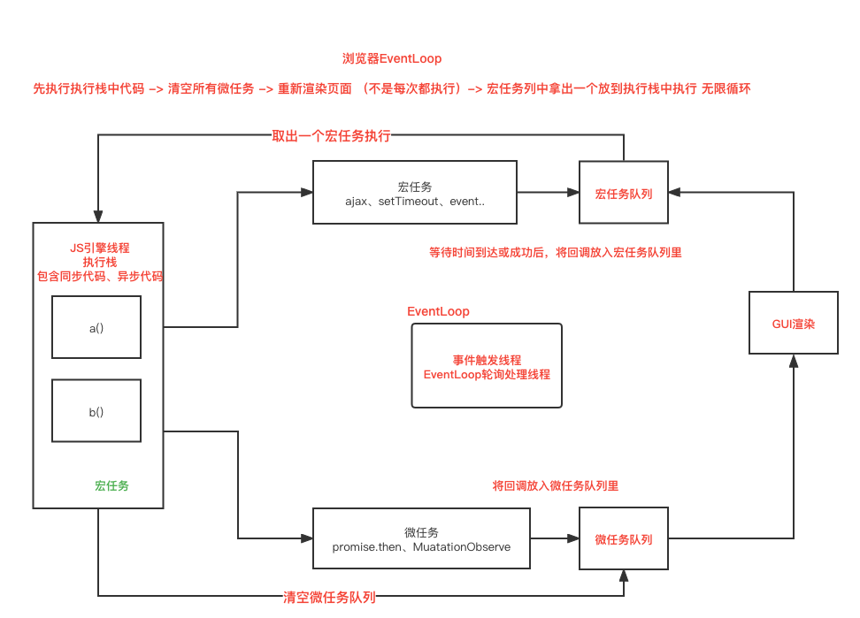
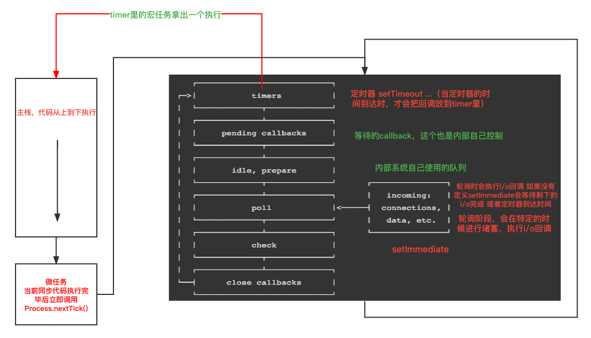

<!--
 * @Author: xinxu
 * @Date: 2022-12-20 17:22:04
 * @LastEditors: xinxu
 * @LastEditTime: 2022-12-22 14:52:59
 * @FilePath: /Promise/README.md
-->

# 实现 Promise

## 什么是 Promise？我们用 Promise 来解决什么问题？

1. Promise 是异步编程的一种解决方案： 从语法上讲，promise 是一个对象，从它可以获取异步操作的消息；从本意上讲，它是承诺，承诺它过一段时间会给你一个结果。
2. Promise 有三种状态：pending(等待态)，fulfilled(成功态)，rejected(失败态)；状态一旦改变，就不会再变。创造 promise 实例后，它会立即执行。
3. 缺陷：依旧是基于回调函数的，进化--> generator + co / async + await。

## 为什么有 Promise 这个东西

1. 同步的方式写异步的代码，用来解决回调地狱问题。
2. 此外，promise 对象提供统一的接口，使得控制异步操作更加容易。

## 什么是 Promise？

1. Promise，简单说就是一个容器，里面保存着某个未来才会结束的事件（通常是一个异步操作）的结果。
2. 从语法上说，promise 是一个对象，从它可以获取异步操作的的最终状态（成功或失败）。
3. Promise 是一个构造函数，对外提供统一的 API，自己身上有 all、reject、resolve 等方法，原型上有 then、catch 等方法。

## Promise 的两个特点

1. Promise 对象的状态不受外界影响，1）pending 初始状态、2）fulfilled 成功状态、3）rejected 失败状态，Promise 有以上三种状态，只有异步操作的结果可以决定当前是哪一种状态，其他任何操作都无法改变这个状态。
2. Promise 的状态一旦改变，就不会再变，任何时候都可以得到这个结果，状态不可以逆，只能由 pending 变成 fulfilled 或者由 pending 变成 rejected。

## 手写 Promise 包含以下知识点 👇：

1. Promise
2. Class 类
3. 改变 this 指向 (call、apply 和 bind)
4. 事件循环 Event Loop

### 先来介绍两个前置知识：

1. 浏览器的 EvenLoop
   
2. Node 的 EvenLoop
   

## 实现 Promise

### 1. 实现 resolve 和 reject

1. Promise 是一个类，类中的构造函数需要传入一个 executor ，默认就会执行，executor 中有两个参数 分别是 resolve，reject。
2. 调用成功和失败时 需要传递一个成功的原因和失败的原因，如果已经成功了就不能失败了，如果抛出异常按照失败来处理。
