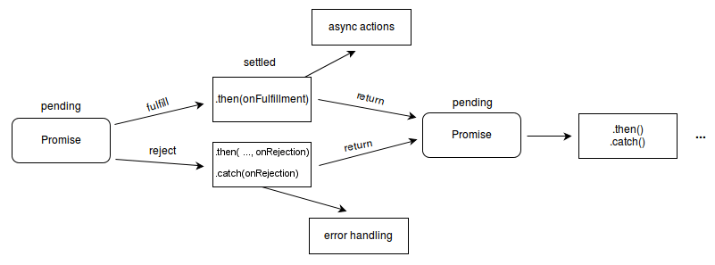

<!--
 * @Author: xinxu
 * @Date: 2022-12-20 17:22:04
 * @LastEditors: xinxu
 * @LastEditTime: 2022-12-22 15:05:28
 * @FilePath: /Promise/README.md
-->

# 实现 Promise

## 什么是 Promise？我们用 Promise 来解决什么问题？

1. Promise 是异步编程的一种解决方案： 从语法上讲，promise 是一个对象，从它可以获取异步操作的消息；从本意上讲，它是承诺，承诺它过一段时间会给你一个结果。
2. Promise 有三种状态：pending(等待态)，fulfilled(成功态)，rejected(失败态)；状态一旦改变，就不会再变。创造 promise 实例后，它会立即执行。
3. 缺陷：依旧是基于回调函数的，进化--> generator + co / async + await。

## 为什么有 Promise 这个东西

1. 同步的方式写异步的代码，用来解决回调地狱问题。
2. 此外，promise 对象提供统一的接口，使得控制异步操作更加容易。

## 什么是 Promise？

1. Promise，简单说就是一个容器，里面保存着某个未来才会结束的事件（通常是一个异步操作）的结果。
2. 从语法上说，promise 是一个对象，从它可以获取异步操作的的最终状态（成功或失败）。
3. Promise 是一个构造函数，对外提供统一的 API，自己身上有 all、reject、resolve 等方法，原型上有 then、catch 等方法。

## Promise 的两个特点

1. Promise 对象的状态不受外界影响，1）pending 初始状态、2）fulfilled 成功状态、3）rejected 失败状态，Promise 有以上三种状态，只有异步操作的结果可以决定当前是哪一种状态，其他任何操作都无法改变这个状态。
2. Promise 的状态一旦改变，就不会再变，任何时候都可以得到这个结果，状态不可以逆，只能由 pending 变成 fulfilled 或者由 pending 变成 rejected。

## 手写 Promise 包含以下知识点 👇：

1. Promise
2. Class 类
3. 改变 this 指向 (call、apply 和 bind)
4. 事件循环 Event Loop

### 先来介绍两个前置知识：

1. 浏览器的 EvenLoop
   
2. Node 的 EvenLoop
   

## 实现 Promise

### 1.实现 resolve 和 reject

1. Promise 是一个类，类中的构造函数需要传入一个 executor ，默认就会执行，executor 中有两个参数 分别是 resolve，reject。
2. 调用成功和失败时 需要传递一个成功的原因和失败的原因，如果已经成功了就不能失败了，如果抛出异常按照失败来处理。
   [resolve&reject](./1.resolve%26reject/promise.js)

### 2.then 方法的实现

[then](./2.then/promise.js)

### 3.then 方法的异步实现

[then 的异步](3.thenAsync/promise.js)

### 4.then 方法的链式调用

因为每次调用 then 方法，会产生新的 Promise，才能保证状态一直改变（当上层 promsie 失败时，之后走起 then 方法的 onReject，返回新的 Promise 会走其 then 方法的 onFulfilled）。

1. 如果 then 方法中（成功或失败），返回的不是一个 Promise，那么会将值（then 的返回值）传递给外层下一次 then 的成功的结果，如果 then 方法出错，抛出异常，则会走外层下一个 then 方法的失败。
2. 如果返回的是一个 Promise，则会用这个 Promise 的成功/失败，走外层下一个 then 的成功/失败。
3. 返回的 Promise 出错（失败）就失败 ---> 其他一律会走下一个 then 的成功里。
4. catch 就是 then 的别名 没有成功只有失败 （找最近的优先处理，处理不了找下一层）（也就是说，当 promise 失败了，会先找 then 的 onReject 方法去返回失败的值，如果找不到就会走 catch）。
   
   [then 方法的链式调用](4.promise/promise.js)

### 5.promise 的其他方法

[promise 的其他方法](5.promiseMethod/promise.js)
